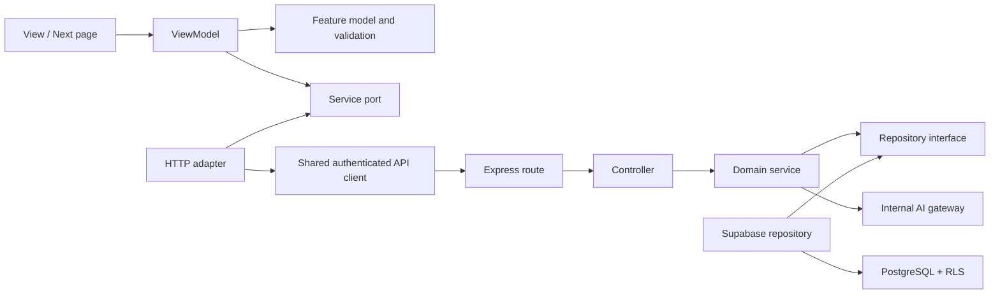

# Echo App — Architecture QA, Product Requirements, and 110-Item Scrum Backlog

**Document status:** Implementation baseline  
**Assessment date:** 2026-08-15  
**Scope:** Next.js frontend, Express API, FastAPI AI service, Supabase/PostgreSQL, CI/CD, privacy, safety, accessibility, and release readiness  
**Normative language:** **MUST** is release-blocking, **SHOULD** is strongly recommended, and **MAY** is optional.

## 1. Executive decision

Echo has a substantial UI, a promising security foundation, and 215 passing JavaScript/TypeScript tests, but it is **not production-ready**. The current release is blocked by backend TypeScript syntax errors, duplicate backend implementations, incomplete real API adapters, conflicting database migrations, five high-severity production dependency findings, sensitive journal drafts stored in browser `localStorage`, and incomplete end-to-end/database/AI verification.

The recommended target is a **modular monolith**, not an immediate microservice split:

- Next.js frontend organized by feature using MVVM.
- One Express API with strict module boundaries and `route -> controller -> service -> repository -> infrastructure` dependencies.
- One separately deployed FastAPI AI service reachable only through authenticated internal calls.
- Supabase/PostgreSQL as the canonical store, with Row Level Security as defense in depth.
- Asynchronous workers for exports, deletion, notifications, and AI jobs.

Microservices SHOULD be introduced only when measured scaling, compliance isolation, or independent deployment needs justify the operational cost.

## 2. Evidence-based QA result

| Area | Result | Evidence / release impact |
|---|---|---|
| Repository analysis | Reviewed | 692 current files were scanned; 1,237 architecture nodes and 1,854 relationships were assembled. The scanner also found 24 stale Git-tracked paths that no longer exist. |
| Frontend typecheck | Pass | Current frontend TypeScript check passed. |
| Backend typecheck | **Fail** | Syntax errors exist in `backend/src/features/journal/journal.routes.ts` and `backend/src/index.ts`. |
| Unit/component tests | Pass with scope limitation | 44 test files and 215 tests pass: frontend 195, backend 20. This does not cover E2E, live database, or AI-service behavior. |
| Frontend production build | Pass with warnings | Next.js build succeeds. Several routes have large first-load bundles; private journal detail is statically generated from mock IDs. |
| Lint | **Fail** | Frontend warnings remain. Backend ESLint configuration is CommonJS inside an ESM package and crashes. |
| AI tests/lint | Not verified | The required `uv` runtime is unavailable locally. CI evidence is still required. |
| Database/RLS tests | Not verified | Local Docker/Supabase execution is unavailable. A clean shadow migration and pgTAP run are release gates. |
| Dependency audit | **Fail** | `npm audit --omit=dev` reports 5 high-severity production findings and 0 critical findings. The current CI threshold only blocks critical issues. |
| E2E tests | Missing | No complete Playwright user-journey suite is configured. |

## 3. Architecture and MVVM QA

### 3.1 Current strengths

- Protected-route middleware fails closed in production when authentication configuration is missing.
- The active Express stack includes Helmet, strict CORS, no-store responses, request IDs, a JSON size limit, bearer-token verification, structured logs, global rate limiting, and a centralized error envelope.
- Sensitive fields have an AES-256-GCM application-encryption path, and database migrations contain RLS policies.
- The frontend is substantially feature-oriented, and most major feature folders already contain model, service, ViewModel, view, and component concepts.
- The AI service uses a constant-time internal bearer-token comparison and disables API documentation in production.
- Reduced-motion support, security headers, and loading/error states exist in parts of the product.

### 3.2 Blocking architecture defects

1. Two backend stacks coexist: the active `src/server.ts`/`src/app.ts` path and legacy `src/index.ts`/duplicate route-feature paths. The legacy path breaks compilation and contains incompatible behavior.
2. Services call Supabase directly; a repository boundary is missing. Data-access, tenant scoping, encryption, and query policy therefore cannot be enforced consistently.
3. The real journal frontend adapter uses raw relative `fetch`, does not use the authenticated shared client, does not map the standard response envelope, and leaves several operations stubbed.
4. UI files directly import services in journal, settings, and verification. The 1,088-line settings view owns orchestration that belongs in a ViewModel.
5. Journal draft helpers write raw title/body content to `localStorage`. Theme and non-sensitive display preferences may remain local; wellness content MUST NOT.
6. The active journal list has no server pagination/search/filter contract and executes N+1 latest-analysis queries while decrypting every returned entry.
7. Database migrations redefine Buddy, export, deletion, notification, and trusted-contact concepts with incompatible names or schemas. `CREATE TABLE IF NOT EXISTS` hides the conflict rather than resolving it.
8. Verification multi-write decisions use compensating updates instead of an atomic database transaction.
9. AI output is not yet supported by a documented clinical/safety evaluation, calibrated risk thresholds, or a production fail-safe path.
10. Existing architecture/status documents contain stale “complete” claims and code examples that conflict with the implementation.

### 3.3 Required dependency rules



Required rules:

- Pages and views MUST NOT import concrete HTTP/database services.
- ViewModels MAY depend on service ports and feature models, never on transport envelopes.
- Controllers MUST validate input and delegate; they MUST NOT contain domain rules or direct SQL/Supabase calls.
- Services MUST enforce ownership, authorization, consent, state transitions, and transaction boundaries.
- Repositories MUST require an authenticated subject/tenant scope for every user-data operation.
- Infrastructure adapters MAY depend inward on ports; domain layers MUST NOT depend outward on Supabase, Express, or FastAPI implementations.
- Every external contract MUST be versioned and represented by a schema, mapper, and contract test.

### 3.4 QA of the supplied architecture documents

The supplied `Layered_architecture.md` and `MVVM_Architecture.md` are useful target-direction documents, but they are not an accurate completion record:

- The layered document prescribes Express microservices. Echo currently gains more safety from one canonical modular API, explicit domain/repository seams, and reliable transactions; service extraction can follow measured need.
- Its good requirements—stateless bearer authentication, UUID validation, standard envelopes, centralized errors, structured logging, RBAC, rate limiting, pagination, Zod validation, Helmet, and tenant isolation—are retained here as measurable release controls.
- The MVVM document's feature-first `Model / ViewModel / View / Service` structure is appropriate. Server `page.tsx` files SHOULD remain thin, and views SHOULD depend on ViewModel contracts rather than concrete network adapters.
- A sample `FormState` declares `status` twice with incompatible meanings. It MUST instead separate request lifecycle (for example `requestStatus`) from the domain form/status value.
- The sample HTTP adapter bypasses Echo's authenticated API client, envelope parser, and model mappers. It MUST not be copied as written.
- The statement “Views import only ViewModel” conflicts with a separate “No model imports” rule. The enforceable rule is: views may import presentation types/models and a ViewModel interface, but not concrete services, transport clients, or database code.
- Claims that migration is complete or all checks pass are stale. Executable build, lint, contract, E2E, AI, migration, RLS, accessibility, security and load evidence is the source of truth.

## 4. Product actors and principal journeys

| Actor | Required capability |
|---|---|
| Guest | Learn what Echo does, read safety/privacy explanations, register, sign in, reset credentials, and reach crisis resources without authentication. |
| Member | Complete consent-aware onboarding; journal; track mood; use grounding; chat with Buddy when eligible; manage contacts, settings, exports, deletion, and sessions. |
| Verified member | Use features gated by age/identity/consent while seeing verification expiry and revocation states. |
| Administrator/reviewer | Review verification cases using least privilege, reason codes, audited decisions, and no unnecessary access to journal/chat content. |
| Support/safety operator | Maintain localized resources and respond to operational alerts without using Echo as an emergency-response system. |
| Background worker | Process notifications, exports, deletion, retention, and AI jobs idempotently with retries and dead-letter handling. |

## 5. Functional and logic requirements

### 5.1 Identity, consent, and authorization

- Authentication MUST use short-lived verified access tokens and secure provider-managed refresh sessions. Passwords and refresh tokens MUST never be stored by Echo application tables or browser `localStorage`.
- Authorization MUST be checked server-side for every object and action. UI gating is informational, never an authorization control.
- Consent MUST be purpose-specific, versioned, timestamped, revocable, and queryable. AI processing, notifications, camera access, and trusted-contact sharing require separate choices.
- Age/identity verification MUST follow a state machine: `not_started -> pending -> approved | rejected | expired | revoked`, with allowed transitions, reviewer reason codes, and audit events.
- Redirect and callback URLs MUST be allow-listed to prevent open redirects.

### 5.2 Journal and mood

- Journal entries MUST support create, read, update, soft delete, restore, and permanent deletion after the retention window.
- List/search/filter/sort MUST execute on the server without decrypting unrelated users' data or returning full bodies for cards.
- Updates MUST use an entity version or `updated_at` precondition and return `409 CONFLICT` rather than silently overwriting concurrent edits.
- Drafts MUST be encrypted server-side or held only in volatile memory. Raw title, body, mood note, or Buddy text MUST NOT be written to browser persistent storage, analytics, error reports, URLs, or logs.
- AI analysis MUST be opt-in per operation, asynchronous, idempotent, cancellable where feasible, and visibly non-diagnostic.

### 5.3 Buddy AI and user safety

- Buddy MUST clearly identify itself as AI, describe limitations, and never claim to be a clinician, emergency service, or human.
- Risk detection MUST combine deterministic urgent-language rules with a separately evaluated classifier. On classifier outage or uncertainty, high-risk flows MUST fail to a safe resource-first response.
- Echo MUST present crisis resources and encourage immediate local help; it MUST NOT silently contact a trusted person or emergency service without an explicit user action and jurisdiction-approved workflow.
- AI prompts MUST minimize personal data, resist prompt injection, enforce input/output limits, prohibit unrestricted tools, and never include unrelated journal history.
- Model/version, policy version, latency, safety category, and outcome MAY be logged using pseudonymous IDs; raw journal/chat text MUST NOT be logged.

### 5.4 Grounding, support, notifications, and data rights

- Grounding timers MUST remain correct across pause/resume, tab throttling, navigation, and background/foreground changes by deriving remaining time from timestamps.
- Crisis resources MUST be available before login, localized, human-reviewed, and cached for offline use without caching private content.
- Notifications MUST be opt-in by channel and purpose, respect timezone and quiet hours, and support revoking stale push tokens.
- Exports MUST run as background jobs, create encrypted artifacts, and expose short-lived signed downloads. Deletion MUST revoke sessions immediately and execute a documented, auditable cascade.
- Trusted contacts MUST verify ownership of their contact channel; sharing and notification permissions MUST be explicit and revocable.

## 6. API, pagination, error, and state contracts

### 6.1 Response envelope

Success:

```json
{
  "success": true,
  "data": {},
  "meta": { "requestId": "uuid", "page": 1, "limit": 20, "total": 0, "totalPages": 0, "hasNext": false }
}
```

Failure:

```json
{
  "success": false,
  "error": { "code": "STABLE_MACHINE_CODE", "message": "Safe user message", "fieldErrors": {} },
  "meta": { "requestId": "uuid" }
}
```

Production responses MUST NOT expose stack traces, SQL/provider errors, internal paths, tokens, or sensitive error details.

### 6.2 Pagination

- Journal, admin verification, audit, export, deletion, notification, and resource lists MUST accept `page` (default `1`) and `limit` (default `20`, maximum `100`).
- Responses MUST include `page`, `limit`, `total`, `totalPages`, and `hasNext`.
- Offset pagination MUST use a stable, allow-listed order with a UUID tie-breaker; default is `created_at DESC, id DESC`.
- Append-only Buddy messages and high-volume audit streams SHOULD use opaque cursor pagination and return `nextCursor` plus `hasNext`.
- Invalid/oversized parameters MUST return a stable `400 VALIDATION_ERROR`; out-of-range valid pages return an empty list, not an error.
- Frontend pagination MUST be URL-backed where navigation is meaningful, preserve filters, label controls accessibly, restore focus, cancel stale requests, and show loading/error/empty states without layout jumps.

### 6.3 ViewModel state

Every asynchronous ViewModel MUST explicitly represent `idle`, `loading`, `success`, `empty`, `error`, and `stale/refreshing` where relevant. Mutations MUST prevent duplicate submission, expose recoverable errors, and use optimistic UI only when rollback is deterministic.

## 7. Security, privacy, and database requirements

| Control area | Required control |
|---|---|
| Data classification | Classify authentication, profile, verification document, journal, mood, chat, contact, analytics, and operational data. Document purpose, lawful/consent basis, retention, access, and deletion behavior. |
| Encryption | TLS in transit; provider encryption at rest; AES-256-GCM application encryption for journal, mood notes, chats, safety plans, and sensitive verification metadata; versioned keys and rotation. |
| Key/secrets management | Secrets MUST live outside Git and frontend bundles, be environment-scoped, rotated, least-privileged, and scanned in CI. Decryption keys MUST NOT share storage with ciphertext backups. |
| RLS/tenant isolation | RLS enabled and forced where applicable. All user tables require authenticated ownership policies; service-role bypass must be restricted to named workers. Cross-user negative tests are mandatory. |
| Input/output | Schema validation for body/query/path/header, UUID validation, allow-listed sort/filter fields, payload limits, output encoding, file magic-byte validation, malware scanning, and quarantine. |
| Abuse protection | Layered IP/account/device rate limits; stricter limits for auth, AI, uploads, verification, export, and deletion; bounded queues and cost budgets. |
| Web security | Strict CSP without broad production exceptions, HSTS, frame protection, MIME sniff prevention, safe referrer/permissions policies, CSRF protection where cookie auth is used, and exact CORS origins. |
| Auditability | Append-only audit events for privileged/data-rights actions with actor, action, target, result, reason, request ID, and time; never store journal/chat bodies in audit records. |
| Resilience | Idempotency for retried mutations/jobs, transactional multi-table writes, bounded retries with jitter, dead-letter queues, backups, restore drills, and tested rollback. |
| Supply chain | Lockfiles, dependency review, production audit blocking high/critical unresolved findings, SAST, secret scanning, artifact provenance/SBOM, and protected CI environments. |

The release security baseline SHOULD map to OWASP ASVS 5.0, OWASP API Security Top 10 (2023), NIST SSDF 1.1, and WCAG 2.2 AA.

## 8. UX polish, animation, accessibility, and performance

- Motion MUST use shared tokens for duration/easing and communicate hierarchy or state. Decorative motion MUST not delay completion or block input.
- OS `prefers-reduced-motion` MUST override saved animation preferences; essential transitions become instant/faded and auto-moving content stops.
- Route transitions MUST preserve or intentionally move focus, announce async outcomes through live regions, and never animate sensitive content into persistent snapshots.
- Dialogs/drawers MUST trap and restore focus, close predictably, prevent background interaction, and work with keyboard and screen readers.
- All experiences MUST work from 320 CSS px upward, with zoom/reflow, safe-area insets, touch targets, clear error association, and non-color-only status indicators.
- WCAG 2.2 AA is the release target, including accessible authentication, focus visibility/not-obscured behavior, target sizing, alternatives for gestures, and tabular equivalents for charts.
- Performance targets at the 75th percentile: LCP <= 2.5 s, INP <= 200 ms, CLS <= 0.1. Non-AI reads SHOULD meet p95 <= 500 ms and writes p95 <= 800 ms under the agreed production load; an accepted asynchronous AI request SHOULD respond within 1 s.
- Initial route JavaScript budgets MUST be defined and enforced. Large settings/admin/chart bundles MUST be split and loaded only when required.

## 9. Scrum backlog — exactly 110 implementation items

Priority: **P0** release blocker, **P1** required for polished production, **P2** planned enhancement. Owner codes: **FE**, **BE**, **DB**, **AI**, **QA**, **DX/DevOps**, **SEC**, **UX**. Estimates are story points.

| ID | Pri | Owner | SP | Scrum story / engineering task and acceptance criteria | Depends on |
|---|---:|---|---:|---|---|
| ECHO-001 | P0 | BE | 2 | Restore a compilable backend baseline. **AC:** fix malformed journal search and server log syntax; backend typecheck and build exit 0. | — |
| ECHO-002 | P0 | BE | 5 | Select `server.ts/app.ts` as the sole composition root and retire/quarantine the legacy stack. **AC:** one server entry, one v1 router, no duplicate runtime routes, behavior tests pass. | 001 |
| ECHO-003 | P0 | BE | 3 | Consolidate duplicate errors, auth types, middleware, and singular/plural feature names. **AC:** one canonical implementation per concern; imports and API paths are documented. | 002 |
| ECHO-004 | P0 | DB | 8 | Establish a clean migration baseline and repeatable shadow reset. **AC:** empty database migrates deterministically; no hidden incompatible `IF NOT EXISTS` definitions. | — |
| ECHO-005 | P0 | DX/DevOps | 3 | Repair ESLint and replace deprecated Next lint commands. **AC:** FE and BE lint execute in ESM mode and CI fails on errors. | 001 |
| ECHO-006 | P1 | DX/DevOps | 2 | Pin supported Node/npm/Python versions across local setup and CI. **AC:** one version policy and lockfile install reproduce all builds. | 005 |
| ECHO-007 | P1 | BE/FE | 5 | Replace stale architecture claims with ADRs for modular monolith, MVVM, API envelope, encryption, and AI boundary. **AC:** documents match executable composition roots and dependencies. | 002 |
| ECHO-008 | P1 | DX/DevOps | 5 | Enforce dependency direction with lint/import rules. **AC:** views cannot import adapters/services; controllers cannot import DB clients; violations fail CI. | 007 |
| ECHO-009 | P0 | FE/BE | 5 | Define versioned API schemas, stable errors, envelopes, and generated/shared types. **AC:** FE adapters parse contracts; malformed responses fail safely; contract tests exist. | 002 |
| ECHO-010 | P1 | QA | 3 | Create requirement-to-code/test traceability. **AC:** every P0/P1 backlog item links to implementation, tests, owner, and release evidence. | 007 |
| ECHO-011 | P0 | BE/SEC | 5 | Make production authentication fail closed across all protected APIs. **AC:** absent/invalid/expired/wrong-audience tokens are rejected consistently and tested. | 002,009 |
| ECHO-012 | P1 | FE/BE | 8 | Add session/device management. **AC:** user can list and revoke sessions; password/security changes revoke required sessions; tokens never appear in logs/storage. | 011 |
| ECHO-013 | P0 | BE/DB | 5 | Implement least-privilege roles for member, reviewer, admin, worker. **AC:** role/action matrix and cross-role negative tests prevent BFLA. | 011,004 |
| ECHO-014 | P0 | FE/BE/DB | 5 | Persist versioned signup terms/privacy/age consent. **AC:** accepted versions and timestamps are auditable; new required versions trigger re-consent. | 009,004 |
| ECHO-015 | P1 | FE/BE | 5 | Persist resumable onboarding as a server state machine. **AC:** reload/device switch resumes safely; skipped/complete transitions are validated. | 011,014 |
| ECHO-016 | P1 | FE/BE | 5 | Complete email verification and rate-limited resend UX. **AC:** enumeration-safe responses, cooldown, expired-link handling, and accessible states. | 011 |
| ECHO-017 | P1 | FE/BE | 5 | Harden password reset and auth redirects. **AC:** one-use expiry, allow-listed redirect targets, session invalidation, enumeration-safe messages, E2E coverage. | 011 |
| ECHO-018 | P1 | FE/BE | 8 | Add MFA enrollment, challenge, recovery codes, and step-up auth. **AC:** recovery is audited; destructive/privileged actions require recent auth. | 012 |
| ECHO-019 | P0 | FE/BE/SEC | 8 | Secure verification-document upload. **AC:** size/type plus magic bytes, malware scan/quarantine, randomized object keys, signed access, retention/deletion, status UX. | 013,090 |
| ECHO-020 | P0 | BE/DB/UX | 8 | Enforce minor/guardian/verification/AI eligibility and expiry rules. **AC:** server state machine, safe denied UX, revocation propagation, policy/legal review evidence. | 013,014 |
| ECHO-021 | P0 | FE/BE | 5 | Replace raw journal fetches with the shared authenticated client, schemas, and mappers. **AC:** list/detail/create/update/delete use real API and envelope; no stubs. | 009,011 |
| ECHO-022 | P0 | FE/BE/DB | 8 | Add journal search/filter/sort/page API. **AC:** defaults 1/20, max 100, stable UUID tie-break, metadata contract, ownership scope, invalid input tests. | 021,094 |
| ECHO-023 | P1 | FE/UX | 5 | Build accessible URL-backed journal pagination. **AC:** filter/page deep links, preserved state, focus/live announcements, stale request cancellation, all states. | 022 |
| ECHO-024 | P0 | BE/DB | 5 | Remove journal N+1 analysis lookup and full-body list decryption. **AC:** bounded query count, summary projection, indexed plan, load-test evidence. | 022,096 |
| ECHO-025 | P0 | FE/BE/SEC | 8 | Remove raw journal drafts from `localStorage` and add encrypted server drafts or volatile-only mode. **AC:** migration/cleanup removes existing keys; no wellness text in persistent browser storage. | 021,093 |
| ECHO-026 | P1 | FE/BE/DB | 5 | Prevent lost journal updates with optimistic concurrency. **AC:** version/precondition required; conflicting writes return 409 and present compare/reload UX. | 021 |
| ECHO-027 | P1 | FE/BE/DB | 5 | Add trash, restore, retention, and permanent deletion. **AC:** ownership/RLS enforced; scheduled purge idempotent; UX communicates deadline. | 021,091 |
| ECHO-028 | P1 | FE/BE | 5 | Implement journal PDF/JSON export through the export worker. **AC:** consent-aware selection, encrypted artifact, expiring signed URL, download/delete audit. | 068 |
| ECHO-029 | P0 | FE/BE/AI | 8 | Implement idempotent, consent-gated journal analysis jobs. **AC:** explicit opt-in, queued/running/succeeded/failed/cancelled states, retry controls, model disclosure. | 021,038 |
| ECHO-030 | P0 | QA | 8 | Add journal unit, integration, RLS, contract, and E2E coverage. **AC:** CRUD, pagination, conflicts, cross-user denial, draft privacy, delete/restore and AI-state journeys pass. | 022-029 |
| ECHO-031 | P0 | FE/BE | 8 | Replace Buddy mocks with the canonical API adapter and endpoints. **AC:** conversations/messages use shared auth client and schemas; offline/error states remain safe. | 009,011,092 |
| ECHO-032 | P0 | BE/DB/SEC | 8 | Store Buddy messages only in the canonical encrypted schema. **AC:** no plaintext `content` column, key version stored, migration/backfill verified, RLS negative tests pass. | 031,093 |
| ECHO-033 | P1 | FE/BE/DB | 5 | Add opaque cursor pagination for conversations/messages. **AC:** stable chronological behavior, no duplicates/gaps under inserts, accessible load-more, bounded limit. | 032,096 |
| ECHO-034 | P1 | FE/BE/AI | 8 | Add streaming response UX with cancel, timeout, retry, and partial-failure rules. **AC:** duplicate sends are idempotent; disconnect never fabricates a completed answer. | 031,084 |
| ECHO-035 | P0 | AI/SEC | 13 | Implement and validate layered safety classification with fail-safe behavior. **AC:** urgent rules + evaluated classifier, documented thresholds, red-team set, outage fallback, safety sign-off. | 031,106 |
| ECHO-036 | P0 | FE/BE/UX | 8 | Implement crisis resource-first UX. **AC:** localized immediate options, clear non-emergency disclaimer, explicit contact action, no silent third-party notification. | 035,055 |
| ECHO-037 | P0 | AI/SEC | 8 | Defend the AI boundary against injection and abuse. **AC:** strict prompt templates, role separation, limits, allow-listed/no tools, output validation, adversarial tests. | 035 |
| ECHO-038 | P0 | FE/BE/AI | 5 | Enforce AI eligibility, consent, verification, and disclosure. **AC:** server gate precedes every request; revoked/expired states stop processing; model/policy version recorded. | 020,035 |
| ECHO-039 | P1 | FE/BE | 5 | Add AI response feedback, report, and conversation deletion. **AC:** reasons are privacy-minimized; reports exclude content by default; deletion follows retention policy. | 032,038 |
| ECHO-040 | P0 | AI/QA | 8 | Build privacy-safe AI observability and release evaluation. **AC:** latency/cost/safety metrics use pseudonymous IDs, no raw content logs, drift/regression gates and rollback criteria. | 035,106 |
| ECHO-041 | P1 | BE/DB | 8 | Create a timezone-aware dashboard aggregation API. **AC:** bounded date range, correct local-day boundaries, empty days, ownership, stable schema, indexed query. | 091,096 |
| ECHO-042 | P1 | FE | 5 | Connect dashboard and insights ViewModels to real adapters. **AC:** mock factories are dev/test-only; loading/empty/error/stale states and cancellation are covered. | 041,009 |
| ECHO-043 | P1 | FE/BE/DB | 8 | Implement mood CRUD with encrypted optional notes. **AC:** validated scale/tags/time, timezone correctness, ownership/RLS, conflicts, accessible form and history. | 091,093 |
| ECHO-044 | P1 | BE/DB | 8 | Provide privacy-preserving emotion trends as server aggregates. **AC:** raw content is not returned; minimum sample/range rules and indexed grouping are tested. | 043,096 |
| ECHO-045 | P1 | AI/UX | 8 | Add explainable, non-diagnostic wellness insights. **AC:** source period, limitations, confidence semantics, dismissal, safety review and no diagnosis language. | 044,040 |
| ECHO-046 | P0 | FE/AI/SEC | 8 | Make facial analysis privacy-first. **AC:** on-device preferred; no frame retention/transmission without explicit consent; clear active indicator; verified cleanup. | 014,106 |
| ECHO-047 | P0 | FE/UX | 5 | Implement camera permission and revocation UX. **AC:** just-in-time explanation, denied/unavailable fallback, stop control, stream tracks always closed on exit. | 046 |
| ECHO-048 | P2 | FE/BE | 8 | Add opt-in weekly/monthly summaries. **AC:** user-selected cadence/timezone, preview, unsubscribe, no sensitive content in notification previews. | 041,064 |
| ECHO-049 | P1 | FE/UX | 5 | Provide accessible tables and exports for every chart. **AC:** screen-reader labels, non-color encoding, keyboard tooltips, same-data tabular view. | 042,044 |
| ECHO-050 | P1 | FE/BE | 5 | Add range caching and performance budgets for insights. **AC:** private responses not publicly cached; invalidation defined; p95/API and bundle budgets pass. | 041,079 |
| ECHO-051 | P1 | FE/BE | 8 | Replace grounding mocks/direct calls with service ports and real APIs. **AC:** catalog, sessions, favorites and completion use schemas; offline behavior is explicit. | 009,011 |
| ECHO-052 | P0 | FE/QA | 5 | Make grounding timers correct across lifecycle changes. **AC:** timestamp-derived time survives pause/tab throttling/backgrounding; hook dependency warnings fixed; fake-clock tests pass. | 051 |
| ECHO-053 | P1 | FE/BE/UX | 5 | Build a versioned grounding exercise catalog. **AC:** duration, steps, modality, contraindication note, locale, publication status and accessible media alternatives exist. | 051 |
| ECHO-054 | P2 | FE/BE | 5 | Add opt-in personalized grounding suggestions. **AC:** user can see why, disable/reset personalization, and use a deterministic non-AI fallback. | 053,045 |
| ECHO-055 | P0 | BE/UX | 5 | Maintain human-reviewed localized crisis/support resources. **AC:** region, language, channel, hours, verification date, owner and expiry review are required. | 091 |
| ECHO-056 | P0 | FE | 5 | Make public crisis resources available offline. **AC:** vetted resource shell caches safely; freshness date visible; journal/chat/auth/API responses are never cached. | 055,080 |
| ECHO-057 | P1 | FE/BE/DB | 8 | Add an encrypted, user-controlled safety plan. **AC:** granular sections, version history, export/delete controls, no automatic sharing, RLS tests. | 093,094 |
| ECHO-058 | P1 | FE/BE/UX | 5 | Add trusted-contact quick reach with explicit confirmation. **AC:** shows exact recipient/action, uses native communication where possible, never silently sends. | 066,057 |
| ECHO-059 | P1 | FE/UX | 5 | Polish grounding accessibility, audio, haptics, and reduced motion. **AC:** captions/text alternative, volume/mute, optional haptics, keyboard control, reduced-motion tests. | 052,073 |
| ECHO-060 | P0 | UX/QA | 5 | Conduct professional safety-content review. **AC:** crisis, grounding, AI and verification copy has named reviewer/version/locale/date and scheduled re-review. | 035,055 |
| ECHO-061 | P0 | FE | 8 | Split the 1,088-line settings view and move orchestration to ViewModels. **AC:** views do not import concrete services; each panel owns typed state/actions and tests. | 008,009 |
| ECHO-062 | P1 | FE/BE | 5 | Standardize settings service ports, factory and contracts. **AC:** production HTTP and test in-memory adapters are interchangeable; no runtime singleton leakage. | 061,009 |
| ECHO-063 | P1 | FE/BE/DB | 5 | Complete profile and avatar persistence. **AC:** validation, safe image processing, signed delivery, replace/delete cleanup, accessible status and RLS. | 062,090 |
| ECHO-064 | P1 | FE/BE/DB | 8 | Implement notification preferences, scheduler, timezone and quiet hours. **AC:** channel/purpose opt-ins, DST tests, idempotent dispatch, unsubscribe and audit. | 092,097 |
| ECHO-065 | P1 | FE/BE | 8 | Add web push with explicit opt-in and token lifecycle. **AC:** capability prompt, test notification, device list, stale-token cleanup, revoke/all-off controls. | 064 |
| ECHO-066 | P0 | FE/BE/DB | 8 | Canonicalize trusted contacts and verify contact channels. **AC:** ownership/challenge expiry, permission scopes, revocation, unique constraints, abuse limits and RLS. | 092,094 |
| ECHO-067 | P1 | FE/BE/DB | 5 | Add privacy dashboard and consent history. **AC:** purposes, versions, grants/revocations, data categories and effects are readable; revocation propagates. | 014,038 |
| ECHO-068 | P0 | BE/DB/SEC | 13 | Implement encrypted asynchronous data exports. **AC:** snapshot manifest, idempotent worker, short-lived signed URL, step-up auth, expiry deletion and audit. | 084,097 |
| ECHO-069 | P0 | BE/DB/SEC | 13 | Implement the account-deletion executor. **AC:** immediate session revocation, grace/cancel policy, transactional job states, cascade/anonymization, legal holds and evidence. | 068,100 |
| ECHO-070 | P1 | FE/BE | 8 | Build a unified account-security page. **AC:** sessions, password, MFA, recovery and recent security events support accessible success/error/re-auth flows. | 012,018,061 |
| ECHO-071 | P1 | FE | 8 | Split oversized settings, verification, admin, design-system and support UI modules. **AC:** feature boundaries are clear, route bundles shrink, behavior tests unchanged. | 061,079 |
| ECHO-072 | P1 | UX/FE | 5 | Audit design tokens, themes and contrast. **AC:** semantic tokens replace one-off values; all modes meet AA contrast; high-contrast states remain distinguishable. | 071 |
| ECHO-073 | P1 | UX/FE | 5 | Define a shared motion system. **AC:** named durations/easings, meaningful transitions, no input blocking, OS reduced-motion overrides stored preferences. | 072 |
| ECHO-074 | P1 | FE/UX | 5 | Add accessible route/view transitions. **AC:** focus moves intentionally, async changes announce, back navigation restores context, reduced motion is instant/faded. | 073 |
| ECHO-075 | P1 | FE/UX | 8 | Complete loading, empty, error, offline, retry and stale states. **AC:** state matrix covers every async ViewModel; skeletons preserve layout; errors are actionable. | 061,071 |
| ECHO-076 | P1 | FE/QA | 8 | Make all primary journeys responsive from 320 px upward. **AC:** zoom/reflow, safe areas, keyboard viewport, orientation, long localization and device matrix pass. | 071,072 |
| ECHO-077 | P0 | FE/QA | 8 | Standardize keyboard, focus, dialog and drawer behavior. **AC:** focus trap/restore, Escape, background inertness, skip links and automated/manual keyboard tests pass. | 071 |
| ECHO-078 | P0 | UX/QA | 13 | Reach WCAG 2.2 AA on critical flows. **AC:** axe has no serious/critical defects; manual screen-reader, accessible-auth, target-size and focus-obscured checks pass. | 072,074,077 |
| ECHO-079 | P1 | FE/DX | 8 | Enforce web performance and JavaScript budgets. **AC:** critical-route LCP/INP/CLS targets, per-route bundle limits, dynamic imports, image/font policy and CI reports. | 071 |
| ECHO-080 | P0 | FE/SEC | 8 | Implement a privacy-safe PWA/cache policy. **AC:** no authenticated API/private HTML/media is persistently cached; logout purges sensitive state; offline scope tested. | 025,056 |
| ECHO-081 | P0 | BE | 5 | Apply the standard envelope and safe error registry everywhere. **AC:** stable codes/statuses/request IDs; production never returns raw provider details or stack traces. | 009 |
| ECHO-082 | P0 | BE/SEC | 8 | Validate every path/query/body/header with Zod. **AC:** UUIDs, enums, dates, sort/filter allow-lists and payload limits cover every route; fuzz tests reject malformed input. | 081 |
| ECHO-083 | P0 | BE/SEC | 8 | Add tiered distributed rate limits. **AC:** global plus account/IP/device limits; stricter auth/AI/upload/export/deletion policies; retry headers and multi-instance store. | 011,082 |
| ECHO-084 | P0 | BE/DB | 8 | Add idempotency keys for retryable mutations/jobs. **AC:** scoped key/request hash/result/TTL; concurrent duplicates return one outcome; mismatch is rejected. | 097 |
| ECHO-085 | P0 | SEC/QA | 13 | Build the API authorization matrix and BOLA/BFLA suite. **AC:** every object/action/role has allow and deny tests, including guessed IDs and admin endpoints. | 013,082,094 |
| ECHO-086 | P0 | BE/DB | 13 | Introduce repository interfaces and scoped Supabase adapters. **AC:** services no longer call Supabase directly; user/tenant scope is mandatory; unit fakes and integration tests exist. | 002,004 |
| ECHO-087 | P1 | BE/SEC | 5 | Standardize Pino logs, traces and redaction. **AC:** request/job correlation, allow-listed metadata, secret/token/content redaction tests, environment-safe verbosity. | 086 |
| ECHO-088 | P0 | FE/BE/SEC | 8 | Harden origin, proxy, CSP and environment boundaries. **AC:** exact CORS/proxy origins, no whole backend env read by FE, nonce/hash CSP plan, production header tests. | 002,009 |
| ECHO-089 | P0 | DX/SEC | 8 | Remediate five high production dependency findings and strengthen gates. **AC:** audited upgrade/mitigation, regression tests; unresolved high/critical findings block release by policy. | 006 |
| ECHO-090 | P0 | BE/SEC | 13 | Build a secure file-upload pipeline. **AC:** auth, quotas, magic bytes, decode validation, malware scan, quarantine, safe re-encode, random keys, signed access and cleanup. | 083,097 |
| ECHO-091 | P0 | DB | 13 | Replace conflicting migrations with a canonical reproducible chain. **AC:** empty and upgrade-path migrations pass in shadow DB; schema diff is reviewed; rollback/runbook exists. | 004 |
| ECHO-092 | P0 | DB/BE | 8 | Resolve duplicate Buddy/export/deletion/preference/contact tables and names. **AC:** one canonical table/API per concept, data migration, compatibility window and deleted obsolete objects. | 091 |
| ECHO-093 | P0 | DB/SEC | 13 | Complete encryption migration and key rotation. **AC:** backfill legacy plaintext, verify/decrypt samples, version keys, rotate without downtime, revoke plaintext access, drop columns safely. | 091 |
| ECHO-094 | P0 | DB/SEC/QA | 13 | Expand RLS tests to every user/worker/admin table. **AC:** owner, other user, anonymous, reviewer and service-role cases; policy/table inventory cannot drift silently. | 091,092 |
| ECHO-095 | P0 | DB | 8 | Add domain constraints and relationship integrity. **AC:** FKs/delete rules, checks, enums/status transitions, uniqueness, non-null rules and consistent `updated_at` triggers. | 092 |
| ECHO-096 | P1 | DB/BE | 8 | Add indexes and query-plan regression checks. **AC:** journal/mood/chat/admin range/search paths have measured plans, no N+1, bounded scans and representative data. | 092,095 |
| ECHO-097 | P0 | DB/BE | 13 | Implement atomic DB functions/transactions for multi-write workflows. **AC:** verification decisions, contacts, exports, deletion and job claims commit once or fully roll back; concurrency tests pass. | 095 |
| ECHO-098 | P1 | DB/SEC | 8 | Create append-only privileged audit records. **AC:** actor/action/target/reason/result/request ID/time, retention/partitioning, tamper resistance, no wellness content. | 097 |
| ECHO-099 | P0 | DB/DX | 8 | Define backup, PITR and restore drills. **AC:** encrypted backups, access separation, RPO <= 24 h, RTO <= 4 h, quarterly restore evidence and incident contacts. | 091 |
| ECHO-100 | P0 | DB/SEC | 8 | Enforce data retention, minimization and anonymization. **AC:** category schedule, automated purge, legal-hold exception, derived/backup handling, measurable deletion SLA. | 092,098 |
| ECHO-101 | P0 | DX/DevOps | 8 | Consolidate duplicate CI into one protected pipeline. **AC:** pinned runtimes, install/lint/typecheck/test/build/audit jobs, cache policy, concurrency cancellation and required checks. | 005,006 |
| ECHO-102 | P1 | QA/FE/BE | 8 | Set risk-based coverage gates and add adapter/ViewModel/service tests. **AC:** changed-code thresholds, critical modules higher, deterministic factories, coverage artifacts. | 008,101 |
| ECHO-103 | P0 | QA/FE/BE | 8 | Add OpenAPI/schema and consumer contract tests. **AC:** route implementation matches spec; FE adapters verified against provider fixtures; breaking changes fail CI. | 009,081 |
| ECHO-104 | P0 | QA | 13 | Add Playwright E2E for critical user journeys. **AC:** auth/onboarding, journal, Buddy eligibility, grounding, settings, export/deletion and admin review; axe and mobile checks included. | 030,070,103 |
| ECHO-105 | P0 | QA/DB | 8 | Run Supabase migrations and pgTAP in CI. **AC:** clean reset, seed, RLS matrix, functions and upgrade path run in isolated containers with retained diagnostics. | 091,094,101 |
| ECHO-106 | P0 | AI/QA | 13 | Make AI lint/tests/evaluations reproducible. **AC:** pinned Python/uv, unit/integration tests, safety and prompt-injection eval sets, latency/cost thresholds and CI artifacts. | 101 |
| ECHO-107 | P0 | SEC/DX | 8 | Add continuous SAST, secret, dependency, container/SBOM and DAST controls. **AC:** severity SLA, justified expiry-based exceptions, protected reports and no secrets in artifacts. | 089,101 |
| ECHO-108 | P1 | DX/BE/FE | 13 | Implement privacy-safe observability, SLOs and alerts. **AC:** 99.9% availability target, API/job/AI/front-end metrics, redaction, actionable alerts, dashboards and runbooks. | 087,040 |
| ECHO-109 | P0 | QA/DX | 13 | Run load, concurrency and resilience tests. **AC:** agreed user profile meets latency/error budgets; rate limits, queue backpressure, failover and recovery are verified. | 083,096,108 |
| ECHO-110 | P0 | QA/Product | 13 | Execute staged release and rollback readiness. **AC:** staging rehearsal, migration/backup/rollback, privacy/security/accessibility/safety sign-offs, feature flags, support and go/no-go record. | 078,099,104-109 |

## 10. Delivery sequence

The 11 epics below can be run as two-week increments, with FE/BE/DB/QA working in parallel only after contract and dependency prerequisites are satisfied.

| Increment | Backlog | Demonstrable outcome |
|---|---|---|
| 1 — Stabilize | 001–010 | One compilable architecture, executable quality gates, authoritative contracts and documents. |
| 2 — Trust and identity | 011–020 | Secure authentication, consent, verification and eligibility journeys. |
| 3 — Journal | 021–030 | Real, paginated, encrypted, conflict-safe journal with complete tests. |
| 4 — Buddy and AI safety | 031–040 | Encrypted production adapter, evaluated safeguards, disclosures and privacy-safe telemetry. |
| 5 — Dashboard and insights | 041–050 | Real aggregated mood/insight experience with privacy and accessible charts. |
| 6 — Grounding and crisis support | 051–060 | Reliable accessible exercises, offline public resources and reviewed safety content. |
| 7 — Settings and data rights | 061–070 | MVVM settings, notifications, contacts, export, deletion and account security. |
| 8 — Product polish | 071–080 | Responsive, performant, animated and WCAG 2.2 AA user experience. |
| 9 — API/security | 081–090 | Consistent validated APIs, authorization, rate limits, repositories and secure uploads. |
| 10 — Database/privacy | 091–100 | Reproducible schema, complete RLS, encryption, transactions, backup and retention. |
| 11 — Release system | 101–110 | Contract/E2E/AI/security/load evidence, observability and controlled production release. |

Dependencies, not the numerical order alone, control sprint commitment. ECHO-001–005, 009, 011, 019–022, 025, 032, 035–038, 046–047, 055–056, 060–061, 066, 068–069, 077–078, and 080–110 marked P0 are release blockers.

## 11. Definition of Ready

A story is ready only when:

- User/safety value, actor, in-scope/out-of-scope behavior, owner, and acceptance criteria are agreed.
- API/schema/state changes, privacy classification, consent and retention implications are identified.
- UX covers loading, empty, error, offline, permission-denied, reduced-motion and keyboard/screen-reader states as applicable.
- Dependencies, migration/rollback, telemetry, threat cases, and test layers are identified.
- Any clinical, legal, privacy, or safety copy has an assigned qualified reviewer.

## 12. Definition of Done and release gates

A story is done only when implementation, review, tests, documentation, observability and rollback are complete. A production release additionally requires:

1. FE and BE lint, typecheck, tests and production builds pass with no ignored release-blocking warning.
2. AI lint/tests and the approved safety regression suite pass in a pinned environment.
3. Clean database reset, upgrade-path migration, pgTAP/RLS matrix, backup and restore rehearsal pass.
4. Contract and E2E suites cover the critical journeys; WCAG 2.2 AA critical-flow audit has no serious/critical defect.
5. No unresolved critical or high production dependency/security finding unless an accountable owner approves a time-bounded documented exception.
6. No raw wellness, verification-document, token or secret data appears in logs, analytics, URLs, browser persistent storage, public caches or CI artifacts.
7. Performance/load targets, 99.9% service SLO instrumentation, alerting, runbooks and rollback are demonstrated in staging.
8. Privacy, security, accessibility and AI/safety owners sign the go/no-go record.

## 13. Standards baseline

- [OWASP Application Security Verification Standard 5.0](https://owasp.org/www-project-application-security-verification-standard/)
- [OWASP API Security Top 10 — 2023](https://owasp.org/API-Security/)
- [NIST Secure Software Development Framework 1.1 (SP 800-218)](https://csrc.nist.gov/projects/ssdf)
- [W3C Web Content Accessibility Guidelines 2.2](https://www.w3.org/TR/WCAG22/)

This backlog is the implementation baseline. Historical phase plans and “complete” statements in the repository are evidence inputs, not proof of release readiness.
