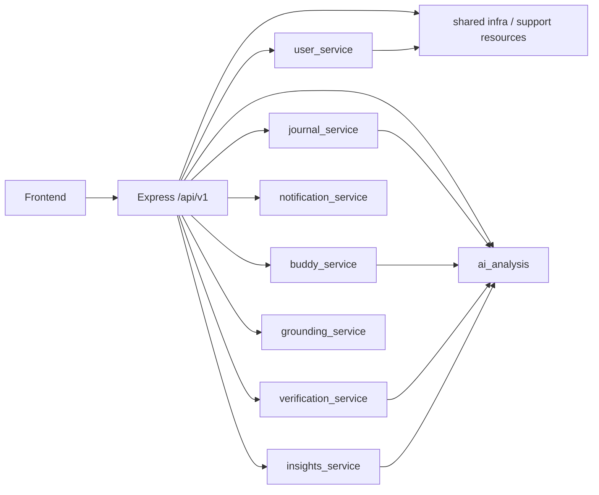

# ECHO Modular-Monolith DB Alignment Plan

## Summary

This plan aligns the repository with a modular monolith where each domain module owns a dedicated Supabase/Postgres schema and all application data flows through the backend API.

The target is not a broad rewrite in one step. The target is a sequence of small, verifiable cutovers that keep the current app working while proving one module at a time.

## Target Module Boundaries

## Target Internal Boundaries

### Backend modules to keep or extract

- `backend/src/features/onboarding` becomes the user/onboarding application service for setup flows only.
- `backend/src/features/settings` becomes the user settings application service only.
- `backend/src/features/journals` becomes the journal application service only.
- `backend/src/features/verification` becomes the verification application service only.
- `backend/src/features/experience` must be split internally so dashboard orchestration, buddy behavior, grounding history, insights aggregation, and support-resource lookup do not remain one coupled service.
- `backend/src/infrastructure/analysis` and `backend/src/infrastructure/ai` remain infrastructure only; they may provide technical clients and provider adapters, but not domain ownership of AI-analysis records.
- `ai_analysis` becomes the persistence owner for analysis artifacts.

## Target Schema Ownership

| Schema | Owner module | Core tables / views / functions |
|---|---|---|
| `user_service` | user onboarding and settings | profiles, consents, notification preferences, privacy preferences, trusted contacts, export requests, deletion requests |
| `journal_service` | journals | journals, drafts, journal analyses |
| `buddy_service` | buddy | conversations, messages, feedback |
| `verification_service` | verification | admins, identity verifications, documents, reviews |
| `notification_service` | notifications | notifications, notification logs |
| `grounding_service` | grounding | grounding sessions, breathing sessions |
| `insights_service` | insights | mood entries and derived insight read models |
| `ai_analysis` | AI analysis | model_versions, analysis_requests, analysis_results, facial_analysis_results, risk_signal_snapshots, safety_events, prompt_templates, analysis_audit_log |
| `shared / public read model` | support and compatibility surfaces | support_resources and any intentionally public read-only resources |

## Public Interfaces Between Modules

The target architecture uses explicit interfaces rather than table reach-through:

- `journals` may request analysis from `ai_analysis` through an application-use-case interface.
- `verification` may request AI-related access checks through a verification-to-AI policy interface, not by reading analysis tables directly.
- `experience` may aggregate dashboard and activity data, but it must query module services rather than each module’s tables.
- `settings` may emit notification preference changes, but the notification module owns delivery state and logs.
- `buddy` may emit safety or escalation signals, but the AI-analysis and notification modules own persistence of those records.

## Legacy-to-Target Table Crosswalk

| Legacy / current table | Target owner table |
|---|---|
| `public.profiles` | `user_service.profiles` |
| `public.user_consents` | `user_service.user_consents` |
| `public.notification_preferences` | `user_service.notification_preferences` |
| `public.privacy_preferences` | `user_service.privacy_preferences` |
| `public.trusted_contacts` | `user_service.trusted_contacts` |
| `public.data_export_requests` | `user_service.data_export_requests` |
| `public.account_deletion_requests` | `user_service.account_deletion_requests` |
| `public.journals` | `journal_service.journals` |
| `public.journal_analyses` | `journal_service.journal_analyses` or `ai_analysis.analysis_results`, depending on the final data model decision |
| `public.buddy_conversations` | `buddy_service.buddy_conversations` |
| `public.buddy_messages` | `buddy_service.buddy_messages` |
| `public.buddy_feedback` | `buddy_service.buddy_feedback` |
| `public.notifications` | `notification_service.notifications` |
| `public.notification_logs` | `notification_service.notification_logs` |
| `public.mood_entries` | `insights_service.mood_entries` |
| `public.model_versions` | `ai_analysis.model_versions` |
| `public.analysis_windows` / `analysis_feedback` / `safety_events` / `support_resources` / `safety_event_resources` | shared compatibility or target domain tables, depending on final ownership proof |
| `verification_*` current public-schema tables | `verification_service.*` |

## Incremental Code Milestones

### Milestone 1: architecture and environment baseline

**Goal**
- Finalize module ownership matrix.
- Confirm live schema availability and exposure.
- Classify all legacy tables and all ambiguous query paths.

**Tests / validation**
- Read-only catalog inspection against the target project.
- Static query audit of every `from(...)` call.
- Documentation review for contradictions.

**Acceptance criteria**
- Every domain table has a provisional owner.
- Every ambiguous query path is classified.
- Local-vs-live exposure is separated in writing.

### Milestone 2: database contract preparation

**Goal**
- Verify `user_service`, `journal_service`, `buddy_service`, `verification_service`, `notification_service`, `grounding_service`, `insights_service`, and `ai_analysis` tables, grants, and RLS in the target project.

**Tests / validation**
- Read-only schema inventory.
- Catalog checks for `information_schema.tables`, `pg_namespace`, and grants.

**Acceptance criteria**
- Target schemas are proven present and reachable.
- Any missing schema objects are called out before code cutover.

### Milestone 3: user module cutover

**Files / modules**
- `backend/src/features/onboarding`
- `backend/src/features/settings`

**Behavior**
- Move all user/profile/consent/settings writes to the owned schema with explicit schema selection or a module-specific client.
- Replace the incorrect dotted consent call with the approved schema-selection form.

**Acceptance criteria**
- Settings and onboarding round-trips survive refresh and backend restart.
- All writes return database-confirmed rows.

### Milestone 4: journal module cutover

**Files / modules**
- `backend/src/features/journals`

**Behavior**
- Route journals, drafts, and analysis requests through the target schema ownership model.
- Separate the persistence of analysis results from the journal entry model if the final data contract requires it.

**Acceptance criteria**
- Journal create/update/delete/draft/analyze flows persist in the owning schema.
- Returned records come from the database, not optimistic local state.

### Milestone 5: verification module cutover

**Files / modules**
- `backend/src/features/verification`

**Behavior**
- Move verification rows, documents, reviews, and admin state to the owned schema.
- Keep verification access gates explicit and testable.

**Acceptance criteria**
- Submitted applications, documents, and admin decisions persist in the target schema and survive refresh.

### Milestone 6: buddy module cutover

**Files / modules**
- `backend/src/features/experience` internal buddy slice, or extracted buddy module if split earlier

**Behavior**
- Extract buddy conversation/message ownership out of the general experience orchestration.
- Preserve encryption and verification gating.

**Acceptance criteria**
- Conversation and message persistence is owned by buddy, not by experience.

### Milestone 7: notification module cutover

**Files / modules**
- notification writes in journals, verification, settings, and experience

**Behavior**
- Centralize notification-record persistence under `notification_service`.

**Acceptance criteria**
- Other modules emit notification intents or events, not direct notification table writes.

### Milestone 8: dashboard, insights, and AI alignment

**Files / modules**
- `backend/src/features/experience`
- `backend/src/infrastructure/analysis`
- `backend/src/infrastructure/ai`

**Behavior**
- Extract dashboard aggregation from domain persistence.
- Route AI-analysis artifacts to `ai_analysis`.
- Clarify whether `journal_service.journal_analyses` remains a read model or becomes a compatibility view.

**Acceptance criteria**
- The dashboard reads module services or explicit read models.
- AI analysis records are persisted in the AI schema, not hidden in infrastructure.

### Milestone 9: remaining shared and operational modules

**Behavior**
- Resolve support resources, grounding history, audit logging, and any remaining operational tables.
- Decide which objects remain shared infrastructure versus module-owned.

### Milestone 10: legacy cutover

**Behavior**
- Move any remaining active rows out of legacy `public.*` tables into the target schemas only after proof of completeness.
- Remove temporary compatibility paths once every module has proved persistence in its target schema.

### Milestone 11: full validation

**Behavior**
- Run unit, integration, frontend, live/staging, authorization, and encryption validations after each module cutover.

## Incremental Migration Milestones

### Migration milestone sequence

1. Prove target schema availability and exposure in the live project.
2. Add or verify missing target objects without destructive changes.
3. Preserve existing IDs, timestamps, ownership, and encrypted payloads when data movement is required.
4. Cut over reads first where safe, then writes, then cleanup only after validation.
5. Keep rollback paths until row counts, IDs, and relationships match.

### Backup and rollback requirements

- Take a backup or export snapshot before any migration that moves rows.
- Rehearse the migration on local or staging first.
- Keep the legacy source tables intact until the cutover is validated.
- Require explicit rollback instructions for every moved domain.

## Acceptance Criteria by Milestone

### Common criteria

- Database-confirmed records are returned from every mutation.
- Refresh after mutation still shows the saved record.
- Backend restart does not lose the record.
- Unauthorized cross-user access is rejected.
- Plain `public.*` access disappears only after the target schema is verified live.

## Proposed Architecture Rules

1. Every domain module owns one schema.
2. Every module reads and writes only through its own repository/service boundary.
3. No module directly mutates another module’s tables.
4. Cross-module behavior uses service interfaces, use cases, or explicit read contracts.
5. Frontend calls backend APIs, not internal Supabase schemas.
6. Service-role Supabase credentials remain backend-only.
7. `public` tables are treated as legacy unless proven shared infrastructure.
8. Supabase-managed schemas remain untouched as ordinary app schemas.
9. No domain data exists in two competing source-of-truth tables after cutover.
10. Schema ownership, encryption, authorization, and lifecycle must be explicit.

## Gate 1.5 Addendum

- Confirmed exposure blocker: `user_service` and `ai_analysis` are not exposed through the live Data API.
- Revised dependency order: user module first, then journals, verification, notifications, buddy/grounding, insights/AI analysis, experience/dashboard, then legacy cleanup.
- Recommended first implementation slice: user-service exposure and contract cutover after grants/RLS and schema exposure are fixed.
- No data migration should begin until the live target schema can be reached through the backend role.

## New project addendum

- The new non-production Supabase project ref is `lruciislmmqvcwweqjop`.
- Repository migrations were pushed successfully to that project, along with `supabase/seed.sql`.
- Postgres now contains the target schemas, but the REST layer still does not expose `user_service` or `ai_analysis`.
- Type generation has been completed once against the new project and stored in `backend/src/infrastructure/supabase/database.types.ts`.
- The next safe implementation gate is backend schema-qualified client alignment, followed by REST exposure confirmation, contract tests, and then feature-by-feature cutover.
