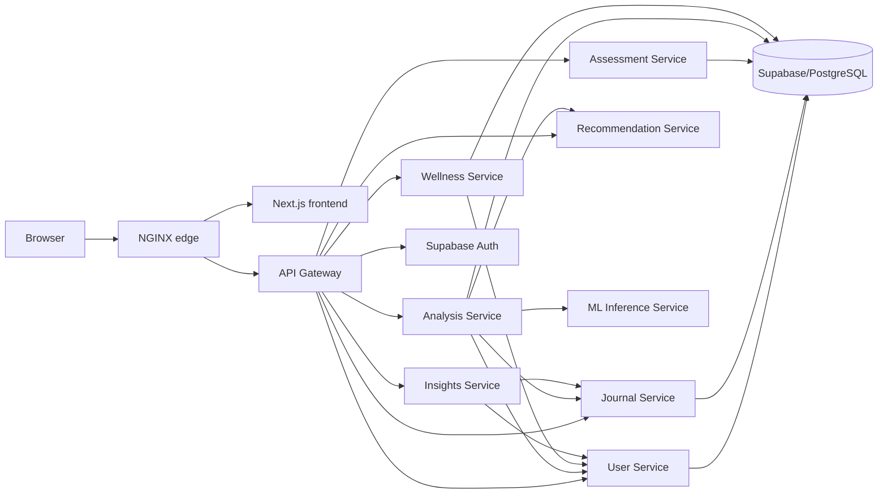

# ECHO microservices architecture

This document describes the implemented architecture at the repository head. It is not a proposal.

## Runtime topology

Only NGINX is host-published by Compose. The browser uses `/api/v1`; it never sees internal service DNS names. NGINX forwards API traffic to the application gateway, which validates the Supabase access token, creates or preserves `X-Request-Id`, signs the user context with HMAC-SHA256 using the destination service's unique token, and forwards to one domain service. Internal callers receive only the target-service tokens required by the documented dependency graph and re-sign user context for that destination when user authority is required.

## Service catalog

| Service | Runtime | Boundary and responsibility | Exposure | Dependencies | Start | Health |
|---|---|---|---|---|---|---|
| API Gateway | Node 24 / Express | Public routing, Supabase Auth validation, rate limits, correlation IDs, signed identity, timeout/error mapping | Internal to NGINX; sole application API edge | Supabase Auth and all domain APIs | `npm run dev -w @echo/api-gateway` | `/api/v1/health` |
| User Service | Node 24 / Express | Profiles, onboarding, settings, consent, trusted contacts, exports/deletion requests, verification, notifications, audit recording | Internal | Supabase Data/Storage | `npm run dev -w @echo/user-service` | `/health` |
| Journal Service | Node 24 / Express | Encrypted journal CRUD and encrypted drafts; consented analysis-input API | Internal | Supabase Data | `npm run dev -w @echo/journal-service` | `/health` |
| Assessment Service | Node 24 / Express | Encrypted mood entries and deterministic PHQ-8 screening calculation | Internal | Supabase Data | `npm run dev -w @echo/assessment-service` | `/health` |
| Analysis Service | Python 3.12 / FastAPI | Analysis orchestration and result lifecycle; never loads models or reads journal tables | Internal | User, Journal, ML, Recommendation, Supabase Data | `uv run uvicorn app.main:app --port 8000` in `ai-service/` | `/health` |
| ML Inference Service | Python 3.12 / FastAPI | Model artifact validation, model loading boundary, inference contract, independent urgent-language safety signal | Internal | Model artifacts/runtime only | `uv run uvicorn app.main:app --port 8001` in `ml/` | `/health`, `/health/ready` |
| Recommendation Service | Node 24 / Express | Rule-based CBT/wellbeing/urgent-support recommendation selection plus verified support-resource context | Internal | Read-only `support_resources` through `recommendation_service_role` | `npm run dev -w @echo/recommendation-service` | `/health` |
| Wellness Service | Node 24 / Express | Buddy conversations, grounding sessions, verified support-resource retrieval | Internal | User API and Supabase Data | `npm run dev -w @echo/wellness-service` | `/health` |
| Insights Service | Node 24 / Express | Dashboard and emotion-pattern derivation from domain APIs | Internal | User and Journal APIs; no database access | `npm run dev -w @echo/insights-service` | `/health` |
| Frontend | Node 24 / Next.js | MVVM UI and public gateway adapters | Internal to NGINX | Gateway and Supabase Auth client | `npm run dev -w frontend` | `/` |

Each service has its own package or Python project, entry point, environment file, tests, Dockerfile, health route, and process. No service imports another service's source.

## API boundaries

Public gateway-compatible routes:

- User: `/api/v1/onboarding/*`, `/api/v1/settings/*`, `/api/v1/verification*`, `/api/v1/admin/verifications*`
- Journal: `/api/v1/journals` and `/api/v1/journals/draft`; CRUD by journal ID
- Analysis: `POST /api/v1/journals/:id/analyze`, `GET /api/v1/journals/:id/analyses`
- Assessment: `/api/v1/moods`, `POST /api/v1/assessments/phq8`
- Wellness: `/api/v1/buddy/*`, `POST /api/v1/grounding/sessions`, `GET /api/v1/support-resources`
- Insights: `GET /api/v1/dashboard`, `GET /api/v1/insights/emotions`
- Recommendation: `POST /api/v1/recommendations`

Internal-only routes:

- Journal `GET /api/v1/internal/journals/:id/analysis-input`
- User `GET /api/v1/internal/verification`
- User `GET /api/v1/internal/analysis-access` (verification plus active account-level journal-analysis consent)
- User `POST /api/v1/internal/notifications` and `/api/v1/internal/audit-events`
- Recommendation `POST /api/v1/internal/recommendations`
- ML `POST /v1/infer` and `GET /v1/model`

All HTTP clients use environment URLs, bounded timeouts, JSON validation at their boundaries, request-ID propagation, target-specific bearer credentials, and explicit unavailable/timeout mapping. The dependency graph is intentionally acyclic and recorded in `service-map.json`.

## Database architecture and ownership

Supabase Auth stays in `auth.*`. `public` is the one canonical application schema because it contains the mature encrypted/RLS-hardened tables and matches the live application shape. The prior schema-per-service migration created unexposed duplicate tables and runtime code then attempted invalid `.from("schema.table")` calls. Commit `1a8478e` restored live public-table access but did not retire those duplicates, producing two architectural stories.

Migration `20260828000000_canonical_public_service_ownership.sql` fixes this additively. It:

1. aborts if any experimental schema or compatibility table contains rows;
2. otherwise drops those unused duplicates;
3. revokes protected application-table access from browser `anon`/`authenticated` roles;
4. grants each non-login PostgREST service role only its owned tables;
5. permits PostgREST's authenticator to assume those roles;
6. retains RLS as defense-in-depth while table grants enforce service ownership.

Production must provision a server-only Supabase JWT/API key for each custom role. The gateway service-role key is used only for Supabase Auth verification and is never shared with domain services.

| Canonical table | Owner/writer | Allowed readers | Cross-service rule / reason |
|---|---|---|---|
| `profiles` | User | User API only | Profile is account data |
| `user_consents` | User | User API only | Consent lifecycle and analysis gate |
| `notification_preferences` | User | User API only | Insights reads via User API |
| `privacy_preferences` | User | User API only | Account privacy policy |
| `trusted_contacts` | User | User API only | Sensitive account contact data |
| `data_export_requests` | User | User API only | Canonical export workflow |
| `account_deletion_requests` | User | User API only | Canonical deletion workflow |
| `notifications` | User | User API only | Other services request notification creation by API |
| `verification_admins` | User | User API only | Verification is grouped with account lifecycle |
| `identity_verifications` | User | User API only | Encrypted verification state |
| `verification_documents` | User | User API only | Metadata plus private Storage bucket |
| `verification_reviews` | User | User API only | Administrative account decision trail |
| `audit_events` | User | User API only | Other services submit redacted events by API |
| `journals` | Journal | Journal API only | Encrypted journal source of truth |
| `journal_drafts` | Journal | Journal API only | Encrypted single-user draft |
| `mood_entries` | Assessment | Assessment API only | Mood-tracking history |
| `journal_analyses` | Analysis | Analysis API only | Journal service cannot query results directly |
| `analysis_windows` | Analysis | Analysis only | Internal analysis chunks |
| `analysis_feedback` | Analysis | Analysis only | Analysis-specific feedback |
| `model_versions` | Analysis | Analysis only | Records deployed analysis model identity |
| `safety_events` | Analysis | Analysis only | Analysis safety lifecycle |
| `safety_event_resources` | Analysis | Analysis only | Analysis safety-resource association |
| `buddy_conversations` | Wellness | Wellness API only | Buddy domain state |
| `buddy_messages` | Wellness | Wellness API only | Encrypted Buddy content |
| `grounding_sessions` | Wellness | Wellness API only | Grounding completion history |
| `support_resources` | Migration-curated platform data | Wellness and Recommendation read-only roles | No runtime writer; verified seed/catalog |

`Insights` owns no base tables. It derives views by calling User and Journal APIs. Recommendation currently persists nothing. ML has no database access.

## Major flows

Authentication: browser signs in with Supabase Auth, sends the access token to the gateway, gateway verifies it with Supabase Auth, then signs the user/request context for the destination service. Internal services reject unsigned or stale identity headers.

Journal creation/retrieval: browser → gateway → Journal Service → role-scoped `journals`/`journal_drafts` tables. Plaintext is encrypted before persistence and decrypted only inside Journal Service.

Journal analysis: browser → gateway → Analysis Service → User analysis-access API (verification plus account-level consent) → Journal analysis-input API (per-entry consent) → ML inference API → Analysis-owned result table → Recommendation API → response. ML unavailability marks/returns failure and never invents a score.

PHQ-8: browser → gateway → Assessment Service. Exactly eight answers in the range 0–3 are summed into the established severity bands; the response includes a non-diagnostic disclaimer.

Insights/dashboard: browser → gateway → Insights Service → Journal and User APIs. Insights has no table grants.

Buddy/grounding/support: browser → gateway → Wellness Service. Buddy verification is checked through User API; urgent audit events are submitted to User API; grounding writes `grounding_sessions`; support catalog reads are public only through the gateway.

## Tradeoffs and limitations

- One physical Supabase/PostgreSQL instance is retained, but table grants and separate service-role JWTs enforce logical ownership. Separate databases can be introduced later without changing public APIs.
- Synchronous REST is used because all current flows require immediate responses and there is no demonstrated queue requirement.
- Verification and notifications remain in User Service because their current volume and lifecycle are account-centric; extracting tiny pass-through services would add failure modes without an independent runtime need.
- Buddy, grounding, and support resources share Wellness Service because they form one immediate-support domain. Insights remains separate because it composes read models and owns no transactional data.
- Real ML inference is not available: model artifacts, a validated Torch/Transformers loader, and an evaluation manifest are absent. ML health works, readiness/inference return `503`, and Analysis propagates that failure.
- The corrective database migration intentionally fails on non-empty abandoned tables/schemas. That is a safe operational gate, not silent data loss; any such deployment requires an explicit one-time data reconciliation.

## Architecture audit

`npm run architecture:check` rejects cross-service source imports, deprecated backend imports, forbidden table references, circular dependencies, frontend internal topology/credential leaks, hardcoded internal localhost dependencies, and Compose topologies that restore the old backend. Docker and database runtime checks still require Docker/Supabase tooling on the host.
