# ECHO Backend Integration Architecture

> Version 1.0 — Planned architecture. The backend is not yet implemented.
> This document defines the target backend contract for the ECHO frontend.

---

## 1. Intended Backend Stack

| Component | Technology | Purpose |
|-----------|-----------|---------|
| API Framework | **FastAPI** (Python) | REST API endpoints |
| Database | **Supabase PostgreSQL** | Relational data storage |
| Authentication | **Supabase Auth** | User registration, login, session management |
| Authorization | **Row-Level Security (RLS)** | Per-row access control in PostgreSQL |
| AI Services | **FastAPI background tasks** | Emotion analysis, risk scoring, Buddy responses |
| File Storage | **Supabase Storage** | Export files, optional image attachments |
| Real-time | **Supabase Realtime** | Buddy streaming responses, live sync |

---

## 2. Authentication Flow

```
Browser                          FastAPI                          Supabase
  │                                │                                │
  │  POST /api/v1/auth/login       │                                │
  │ ──────────────────────────────▶│  POST /auth/v1/token           │
  │                                │ ──────────────────────────────▶│
  │                                │  ◀──── access_token + user ────│
  │  ◀──── access_token + user ────│                                │
  │                                │                                │
  │  GET /api/v1/journals          │                                │
  │  Authorization: Bearer <token> │                                │
  │ ──────────────────────────────▶│  Validate token with Supabase  │
  │                                │ ──────────────────────────────▶│
  │                                │  ◀──── user_id ────────────────│
  │                                │                                │
  │  ◀──── journal entries ────────│  Query: WHERE user_id = ...   │
  │                                │  (enforced by RLS + API)       │
```

### Token Handling

- Frontend receives `access_token` from Supabase Auth (via FastAPI proxy or directly)
- Token stored in memory (not localStorage by default for sensitive apps)
- All API requests include `Authorization: Bearer <token>` header
- FastAPI validates token with Supabase Admin API on each request (or uses JWT verification)
- Token refresh via Supabase `/auth/v1/token?grant_type=refresh_token`

### Security

- **No service-role key in the browser** — all Supabase calls go through FastAPI
- **RLS enabled** — all database tables have row-level security policies
- **User ownership** — every row has a `user_id` column referencing `auth.users`
- **API validation** — FastAPI validates that `user_id` in JWT matches requested resources

---

## 3. Planned Database Schema (ERD)

> This ERD is a **planned architecture document**. No database tables exist yet.
> Contains 13 entities. `user_sessions` is not included — session management is handled by Supabase Auth.

```mermaid
erDiagram
    profiles {
        uuid id PK
        uuid user_id FK "references auth.users"
        text display_name
        text timezone
        text buddy_tone
        int streak_days
        jsonb goals
        timestamp created_at
        timestamp updated_at
    }

    user_consents {
        uuid id PK
        uuid user_id FK
        boolean diagnostic_acknowledgement
        boolean facial_analysis_opt_in
        boolean journal_analysis_consent
        boolean crisis_resource_acknowledgement
        timestamp consented_at
        timestamp updated_at
    }

    journal_entries {
        uuid id PK
        uuid user_id FK
        text title
        text body
        text mood "calm|happy|neutral|sad|anxious|angry"
        text[] emotions
        text[] tags
        text privacy_status "private|shared"
        boolean analysis_consent
        int risk_score
        text risk_band "low|mild|moderate|high|severe"
        timestamp created_at
        timestamp updated_at
        timestamp deleted_at "soft delete"
    }

    journal_drafts {
        uuid id PK
        uuid user_id FK
        text title
        text body
        text mood
        text[] tags
        timestamp created_at
        timestamp updated_at
    }

    journal_analysis {
        uuid id PK
        uuid journal_entry_id FK
        uuid user_id FK
        jsonb emotion_scores
        jsonb risk_assessment
        text perspective
        text summary
        timestamp analyzed_at
    }

    mood_checkins {
        uuid id PK
        uuid user_id FK
        text mood
        text note
        timestamp created_at
    }

    buddy_conversations {
        uuid id PK
        uuid user_id FK
        text title
        timestamp created_at
        timestamp updated_at
        timestamp deleted_at
    }

    buddy_messages {
        uuid id PK
        uuid conversation_id FK
        uuid user_id FK
        text role "user|buddy"
        text content
        jsonb metadata
        timestamp created_at
    }

    trusted_contacts {
        uuid id PK
        uuid user_id FK
        text name
        text relationship
        text phone
        text email
        text preferred_method
        boolean consent_acknowledged
        timestamp created_at
        timestamp updated_at
    }

    notification_preferences {
        uuid id PK
        uuid user_id FK
        boolean journal_reminder
        boolean mood_reminder
        boolean grounding_reminder
        boolean buddy_follow_up
        boolean security_notifications
        time quiet_hours_start
        time quiet_hours_end
        timestamp updated_at
    }

    facial_analysis_results {
        uuid id PK
        uuid user_id FK
        jsonb expression_scores
        text dominant_expression
        int session_duration_seconds
        timestamp analyzed_at
    }

    risk_signals {
        uuid id PK
        uuid user_id FK
        int score
        text band
        jsonb contributing_factors
        timestamp calculated_at
    }

    export_requests {
        uuid id PK
        uuid user_id FK
        text format "pdf|txt|json"
        text[] categories
        text status "pending|processing|ready|failed"
        text file_url
        timestamp requested_at
        timestamp completed_at
    }

    profiles ||--|| user_consents : "has"
    profiles ||--o{ journal_entries : "writes"
    profiles ||--o{ journal_drafts : "drafts"
    journal_entries ||--o{ journal_analysis : "analyzed as"
    profiles ||--o{ mood_checkins : "records"
    profiles ||--o{ buddy_conversations : "has"
    buddy_conversations ||--o{ buddy_messages : "contains"
    profiles ||--o{ trusted_contacts : "manages"
    profiles ||--o{ notification_preferences : "configures"
    profiles ||--o{ facial_analysis_results : "opts into"
    profiles ||--o{ risk_signals : "receives"
    profiles ||--o{ export_requests : "requests"
```



---

## 4. Planned API Endpoints

### Authentication

| Method | Path | Description | Auth |
|--------|------|-------------|------|
| POST | `/api/v1/auth/signup` | Create account | No |
| POST | `/api/v1/auth/login` | Log in | No |
| POST | `/api/v1/auth/logout` | Log out | Yes |
| POST | `/api/v1/auth/refresh` | Refresh token | Yes |
| POST | `/api/v1/auth/forgot-password` | Request reset email | No |
| POST | `/api/v1/auth/reset-password` | Reset password with token | No |

### Profiles

| Method | Path | Description | Auth |
|--------|------|-------------|------|
| GET | `/api/v1/profile` | Get current profile | Yes |
| PATCH | `/api/v1/profile` | Update profile | Yes |

### Journal

| Method | Path | Description | Auth |
|--------|------|-------------|------|
| GET | `/api/v1/journals` | List entries (paginated, filterable) | Yes |
| POST | `/api/v1/journals` | Create entry | Yes |
| GET | `/api/v1/journals/{journalId}` | Get entry detail | Yes |
| PATCH | `/api/v1/journals/{journalId}` | Update entry | Yes |
| DELETE | `/api/v1/journals/{journalId}` | Soft-delete entry | Yes |
| POST | `/api/v1/journals/drafts` | Save draft | Yes |
| PATCH | `/api/v1/journals/drafts/{draftId}` | Update draft | Yes |
| DELETE | `/api/v1/journals/drafts/{draftId}` | Delete draft | Yes |
| POST | `/api/v1/journals/{journalId}/analysis` | Request analysis | Yes |
| GET | `/api/v1/journals/{journalId}/analysis` | Get analysis results | Yes |
| GET | `/api/v1/journals/{journalId}/export` | Export single entry | Yes |

### Buddy

| Method | Path | Description | Auth |
|--------|------|-------------|------|
| GET | `/api/v1/buddy/conversations` | List conversations | Yes |
| POST | `/api/v1/buddy/conversations` | Create conversation | Yes |
| PATCH | `/api/v1/buddy/conversations/{id}` | Rename conversation | Yes |
| DELETE | `/api/v1/buddy/conversations/{id}` | Delete conversation | Yes |
| GET | `/api/v1/buddy/conversations/{id}/messages` | List messages | Yes |
| POST | `/api/v1/buddy/conversations/{id}/messages` | Send message (sync or streaming) | Yes |

### Insights

| Method | Path | Description | Auth |
|--------|------|-------------|------|
| GET | `/api/v1/insights/emotions` | Emotion trends with time range | Yes |
| GET | `/api/v1/insights/risk` | Risk signal history | Yes |
| GET | `/api/v1/insights/facial` | Facial analysis aggregates | Yes |

### Settings

| Method | Path | Description | Auth |
|--------|------|-------------|------|
| GET | `/api/v1/settings/notifications` | Get notification preferences | Yes |
| PATCH | `/api/v1/settings/notifications` | Update notification preferences | Yes |
| GET | `/api/v1/settings/trusted-contacts` | List trusted contacts | Yes |
| POST | `/api/v1/settings/trusted-contacts` | Add trusted contact | Yes |
| PATCH | `/api/v1/settings/trusted-contacts/{id}` | Update trusted contact | Yes |
| DELETE | `/api/v1/settings/trusted-contacts/{id}` | Remove trusted contact | Yes |
| POST | `/api/v1/settings/export` | Request data export | Yes |
| GET | `/api/v1/settings/export/{id}` | Check export status | Yes |
| POST | `/api/v1/settings/delete-data` | Request data deletion | Yes |

### Crisis Resources

| Method | Path | Description | Auth |
|--------|------|-------------|------|
| GET | `/api/v1/crisis/resources` | Get crisis resources (regional) | No |
| GET | `/api/v1/crisis/hotlines` | Get hotline directory | No |

### Grounding

| Method | Path | Description | Auth |
|--------|------|-------------|------|
| POST | `/api/v1/grounding/sessions` | Log a completed session | Yes |
| GET | `/api/v1/grounding/history` | Get grounding session history | Yes |

---

## 5. API Convention

### Standard Response Format

```json
// Success
{
  "data": { ... },
  "meta": {
    "page": 1,
    "limit": 20,
    "total": 100
  }
}

// Error
{
  "error": {
    "code": "VALIDATION_ERROR",
    "message": "Title is required",
    "field": "title",
    "detail": "body.title: field required"
  }
}
```

### Standard Error Codes

| Code | HTTP Status | Description |
|------|-------------|-------------|
| `VALIDATION_ERROR` | 422 | Request body validation failed |
| `AUTHENTICATION_ERROR` | 401 | Missing or invalid token |
| `AUTHORIZATION_ERROR` | 403 | Token valid but insufficient permissions |
| `NOT_FOUND` | 404 | Resource not found |
| `CONFLICT` | 409 | Resource already exists or state conflict |
| `RATE_LIMITED` | 429 | Too many requests |
| `INTERNAL_ERROR` | 500 | Server error |
| `AI_SERVICE_UNAVAILABLE` | 503 | Analysis service temporarily unavailable |

### Pagination

All list endpoints accept:
- `?page=1` (default: 1)
- `?limit=20` (default: 20, max: 100)

Response includes `meta.page`, `meta.limit`, `meta.total`.

### Filtering Convention

List endpoints accept optional query parameters for filtering:
- `?search=keyword` — Full-text search
- `?mood=calm` — Filter by mood
- `?sort=newest` — Sort order
- `?start_date=2026-01-01&end_date=2026-12-31` — Date range

---

## 6. Environment Configuration

```env
# .env.example — ECHO environment configuration

# Application
NEXT_PUBLIC_APP_URL=http://localhost:3000
NEXT_PUBLIC_API_URL=http://localhost:8000/api/v1

# Mock adapter toggle
NEXT_PUBLIC_USE_MOCK=true

# Supabase (browser-safe anon key only)
NEXT_PUBLIC_SUPABASE_URL=
NEXT_PUBLIC_SUPABASE_ANON_KEY=

# Feature flags
NEXT_PUBLIC_ENABLE_BUDDY=true
NEXT_PUBLIC_ENABLE_FACIAL_ANALYSIS=true
NEXT_PUBLIC_ENABLE_ANALYTICS=false

# Crisis resources (configured per deployment)
NEXT_PUBLIC_CRISIS_HOTLINE_NATIONAL=988
NEXT_PUBLIC_CRISIS_TEXT_LINE=741741
NEXT_PUBLIC_EMERGENCY_NUMBER=911
```

---

## 7. Mock-to-HTTP Adapter Migration Plan

### Phase 1 (Current) — Mock only
- All features use `MockAdapter`
- Mock data in `lib/mock-data.ts`
- No network calls

### Phase 2 — Service interface isolation
- Typed service interfaces defined
- Mock adapters implement interfaces
- ViewModels call services through interfaces (not yet — Phase 3+)

### Phase 3 — HTTP adapter ready
- `HttpAdapter` classes implement the same interfaces
- Environment config toggles between mock and HTTP
- API client with auth token injection

### Phase 4 — Live backend
- Backend deployed
- `NEXT_PUBLIC_USE_MOCK=false`
- HTTP adapters connect to real FastAPI
- Mock adapters retained for development and testing

---

## 8. RLS Policy Example (Planned)

```sql
-- journal_entries: users can only see their own entries
CREATE POLICY "Users can view their own entries"
  ON journal_entries
  FOR SELECT
  USING (auth.uid() = user_id);

CREATE POLICY "Users can create their own entries"
  ON journal_entries
  FOR INSERT
  WITH CHECK (auth.uid() = user_id);

CREATE POLICY "Users can update their own entries"
  ON journal_entries
  FOR UPDATE
  USING (auth.uid() = user_id);

CREATE POLICY "Users can delete their own entries"
  ON journal_entries
  FOR DELETE
  USING (auth.uid() = user_id);
```
